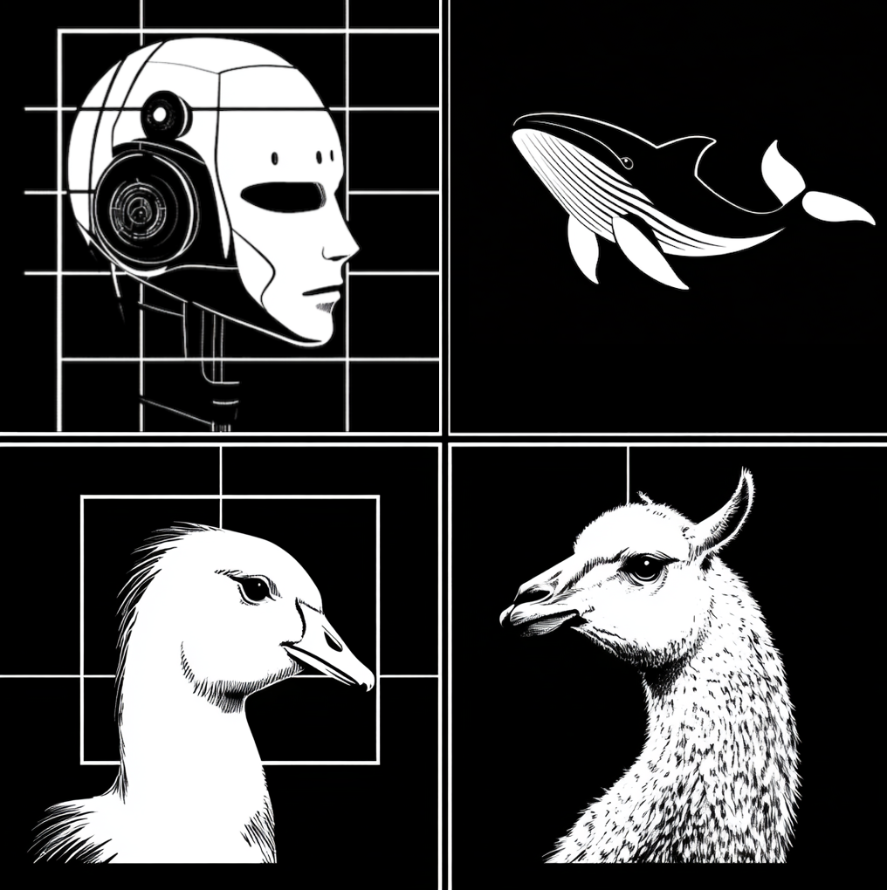
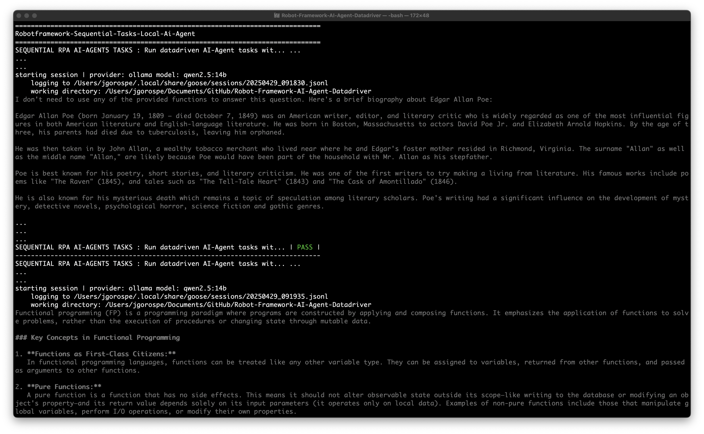

# Robot-Framework-AI-Agent-Datadriver

## LLMs, AI agents, MCP tools, combined with RPA

This experimental toolkit is intended to help explore new technologies related to LLMs, AI agents, and [MCP tools](https://www.pulsemcp.com/) combined with battle-tested Robot Framework RPA strategies. My intention is to demonstrate the usefulness of AI agents and LLMs [beyond the "vibecode" trend](https://x.com/karpathy/status/1886192184808149383). To get the gist of what I mean, scroll down to the `Toolkit Roadmap` section.

I've taken some inspiration from the Codename Goose approach to using [instruction files](https://block.github.io/goose/docs/guides/running-tasks#using-an-instruction-file) to automate AI agents. Instead of Markdown files, I am using [robotframework-datadriver](https://github.com/Snooz82/robotframework-datadriver) and Robot Framework tags to control different categories of AI agent prompts. [Pabot](https://github.com/mkorpela/pabot) is also being used to control parallel running Codename Goose Docker containers.

There are two primary options for using this project. [Both have their strengths and technical challenges.](https://block.github.io/goose/blog/2025/03/31/goose-benchmark/#technical-challenges-with-open-models) I will be writing up more documentation to explain that soon.

- The first option is to use a fully decentralized LLM provider that runs privately and locally on your hardware. The screenshot above shows an example of an automation run using the qwen2.5:14b model on Ollama.
    - In my case, I only use macOS machines for this work, but it is definitely possible to run all of this on Windows or Linux (scroll down to the `Technical Requirements` section for more information).
    - This project was designed, created, and tested on an M3 Max MacBook Pro with the following specifications. **You may need to consider your hardware needs before attempting to run local LLMs.**
        - https://support.apple.com/en-us/117736
- The second option is available to anyone who does not have access to reliable hardware. This option requires the Codename Goose Docker container and an AI cloud provider's API key.
    - *Examples:* Google Gemini, OpenAI, Anthropic, etc.

### Toolkit Roadmap

Years ago, I created another AI project called [robotframework-test-assistant](https://github.com/jg8481/leon/tree/develop/packages/robotframework-test-assistant) that focused mostly on software test activities. I consider this to be its successor and plan to expand this toolkit into the following areas that can assist in other types of activities (some may be useful to testers):

- (April 29, 2024 - **Ready To Use**) An AI agent assistant that can research any topic.
- (April 29, 2024 - **Ready To Use**) An AI agent assistant that can analyze a given text-based dataset using Retrieval Augmented Generation (RAG).
    - *Examples:* Source code, logs, reports, e-books, PDFs, etc.
    - For now, only the [Docker AI agent examples](https://github.com/jg8481/Robot-Framework-AI-Agent-Datadriver/blob/main/agent-instructions/docker-agent1-distributed-instructions.csv) in this toolkit can do this.
- An AI agent assistant that can audit any given source code repo for vulnerabilities.
    - For now, this partially works only in the [Docker AI agent examples.](https://github.com/jg8481/Robot-Framework-AI-Agent-Datadriver/blob/main/agent-instructions/docker-agent1-distributed-instructions.csv) I am working on a version that will use Ollama.
- An AI agent assistant that will utilize relevant and secure MCP Servers from the [4,000+ projects in the Model Context Protocol (MCP) ecosystem](https://www.pulsemcp.com/servers).
- I have more ideas that I will be working on in the future.

### Technical Requirements

The following are the basic technical requirements needed to run the AI agent RPA automation. Please note that **this entire toolkit was developed on a macOS machine**, but this should also work for Windows and Linux users.

- **Python 3** -> https://www.python.org/downloads/
- **Robot Framework** -> https://robotframework.org
- **Docker** -> https://docs.docker.com/
- **Homebrew** -> https://brew.sh/
- **Codename Goose**, a framework for creating AI agents.
    - macOS, Windows, and Linux users can learn how to install it properly here -> https://block.github.io/goose/docs/getting-started/installation
- **Ollama**, a framework for building and running language models on local machines.
    - macOS, Windows, and Linux users can learn how to install it properly here -> https://ollama.com/download
    - macOS users can follow this guide to install it using Homebrew -> https://formulae.brew.sh/formula/ollama
    - After finishing the installation, run this command from your terminal -> `ollama run qwen2.5`

## Quick Start Guide

This is a fully functional RPA toolkit you can start using and customizing for your needs today. I recommend looking at all of the example report Markdown files stored in the `automation-resources/ai-agent-output-collector/ai-agent-output` folder to get an idea of what is currently possible with the AI agent RPA automation being maintained in this project. More documentation will be coming soon, along with a series of related Robot Framework [Medium.com](https://medium.com/@joshua.gorospe) articles I plan to write.

**Before running any of the automation, first make sure that all of the basic technical requirements are installed and working**, then you can run `bash ./start-ai-agent-workflow-experiments.sh Run-Datadriven-Sequential-Local-AI-Tasks ResearchORQuestions` to experiment with a basic workflow.

***

## Big thank you to the following people and groups. Without their open source contributions, this RPA project would not exist.

- Pekka Klarck
- Mikko Korpela
- René Rohner
- Ollama developers
- Codename Goose developers